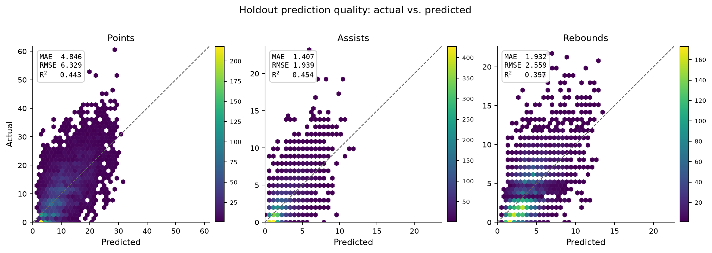
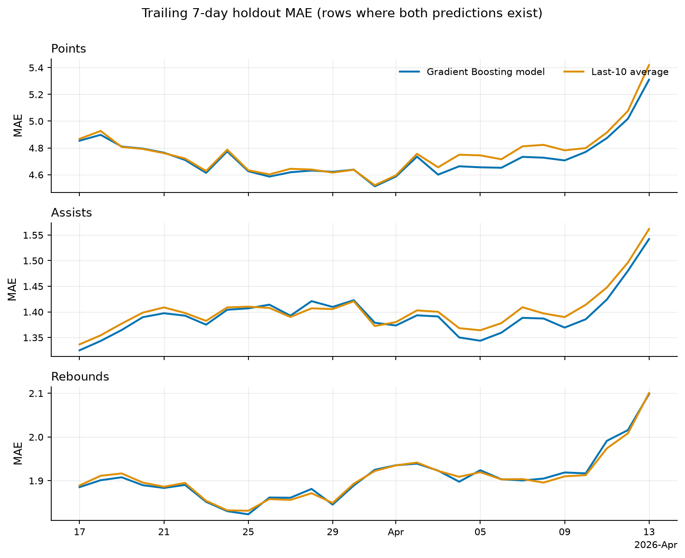
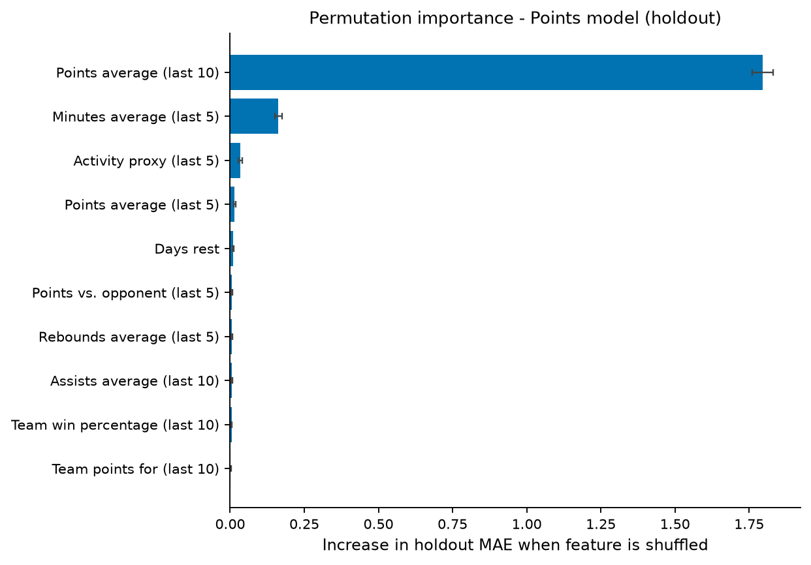
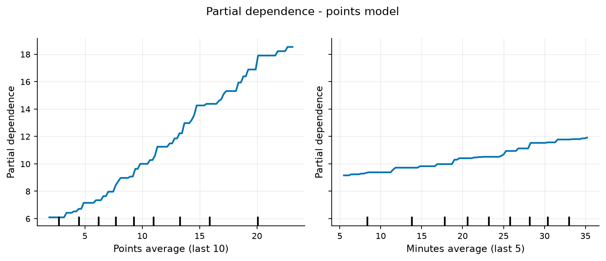

# NBA Player Stat Prediction

[](https://github.com/liamkinnally/nba-scoring-model/actions/workflows/ci.yml)

Python project for predicting NBA player points, assists, and rebounds using historical box scores, recent performance, opponent history, team form, rest, home/away status, and betting-market data.

## What it does

- Pulls NBA schedules and box scores from ESPN-hosted JSON endpoints
- Stores games, teams, players, and player stats in SQLite with SQLAlchemy
- Filters postponed games, special-event teams, and the NBA Cup Championship from regular-season ingestion
- Builds leakage-safe player, opponent, team, schedule, and betting features
- Trains Gradient Boosting models for points, assists, and rebounds
- Tunes models using expanding date-based cross-validation
- Evaluates on the most recent 20% of game dates
- Compares results against 5-game and 10-game rolling-average baselines
- Saves trained models with joblib
- Generates evaluation figures and reporting CSVs with a single `report` command

## Results

Evaluation used the 2025-26 NBA regular season:

- 1,230 regular-season games
- 26,547 player-game observations
- 20,902 training observations
- 5,645 chronological holdout observations
- Holdout begins March 11, 2026

| Target | Model MAE | Model RMSE | Model R² | Last-10 MAE | Last-10 RMSE | Last-10 R² |
|---|---:|---:|---:|---:|---:|---:|
| Points | 4.846 | 6.329 | 0.443 | 4.883 | 6.430 | 0.426 |
| Assists | 1.407 | 1.939 | 0.454 | 1.417 | 1.966 | 0.441 |
| Rebounds | 1.932 | 2.559 | 0.397 | 1.932 | 2.586 | 0.385 |

The tuned models have slightly lower reported error than the 10-game baseline for points and assists. Rebounds are tied on MAE while the model has lower RMSE and higher R².

The rolling baselines contain 5,612 holdout observations because players without prior game history cannot receive a recent-average prediction. Direct head-to-head reporting uses only rows where both methods can make a prediction.

### Holdout prediction quality



The chronological holdout contains 5,645 player-game observations. The models capture a meaningful share of game-to-game variation, while the parity and residual diagnostics also show regression toward the mean at extreme performances.

### Model vs. rolling baseline



For a direct comparison, both methods are evaluated on the same 5,612 holdout observations. The chart reports row-weighted trailing 7-calendar-day MAE and excludes incomplete opening windows.

Across 28 complete windows, the Gradient Boosting model produced lower MAE than the Last-10 baseline in **23 of 28 windows for points** and **22 of 28 for assists**. Rebounds were effectively tied, with the model lower in 15 of 28 windows.

### Model interpretability



Holdout permutation importance identifies the player's 10-game scoring average as the dominant feature for points prediction, with recent minutes providing the strongest secondary contribution. Because several rolling features are correlated, permutation importance should be interpreted as the value of each feature given the others rather than as a complete measure of the underlying concept's importance.



Partial dependence shows the model increasing expected scoring strongly with recent scoring level and more gradually with recent playing time. These plots describe the fitted model's average behavior and should not be interpreted as causal effects.

Additional residual diagnostics and permutation-importance plots for assists and rebounds are available in `reports/figures/`.

## Features

Current features include:

- 5-game and 10-game averages for points, assists, and rebounds
- Recent minutes played
- Recent activity/usage proxy
- Recent performance against the opponent
- Team scoring and defensive form
- Recent team win percentage
- Team pace proxy
- Rest days and back-to-back indicator
- Home/away status
- Game betting total
- Team-oriented betting spread

Historical features use only games played before the target game.

## Evaluation approach

The dataset is ordered by game date.

The most recent 20% of game dates are reserved as a final holdout set. Hyperparameter tuning is performed only on the earlier training period using expanding date-based folds.

Rolling-average baselines are shifted so the game being predicted is never included in its own baseline.

## Project structure

```text
nba-scoring-model/
├── nba_scoring_model/
│   ├── api/
│   ├── data/
│   ├── features/
│   ├── modeling/
│   ├── reporting/
│   ├── cli.py
│   └── config.py
├── reports/          # generated by the report command
│   ├── data/
│   ├── figures/
│   └── cache/        # local cache (gitignored)
├── tests/
├── requirements.txt
└── pyproject.toml
```

## Data source

Historical data is collected from ESPN-hosted NBA scoreboard and game summary JSON endpoints.

These are not documented public APIs, so their response format or availability may change.

## Setup

```bash
python3 -m venv .venv
source .venv/bin/activate
pip install -r requirements.txt
```

## Load historical data

```bash
python -m nba_scoring_model.cli ingest-season \
  --season 2025-26
```

For a small ingestion test:

```bash
python -m nba_scoring_model.cli ingest-season \
  --season 2025-26 \
  --limit 10
```

## Train the models

```bash
python -m nba_scoring_model.cli train \
  --start 2025-10-21 \
  --end 2026-04-14
```

Use `--no-tune` to skip hyperparameter tuning.

## Generate the evaluation report

```bash
python -m nba_scoring_model.cli report
```

Loads the saved models, rebuilds the evaluation frame, reapplies the exact chronological holdout stored in the model metadata, and writes every figure to `reports/figures/` and the underlying CSVs (`holdout_predictions.csv`, `rolling_mae.csv`, `permutation_importance.csv`, `tier_analysis.csv`) to `reports/data/`.

Models saved before evaluation-window metadata was added require the original training range explicitly:

```bash
python -m nba_scoring_model.cli report \
  --start 2025-10-21 \
  --end 2026-04-14
```

The feature frame is cached in `reports/cache/` and validated against the date range, database URL, feature-building code, and model feature columns. Pass `--refresh-cache` after changing the underlying database contents, and `--dpi` to change the export resolution.

## Evaluate baselines

```bash
python -m nba_scoring_model.cli evaluate-baselines \
  --start 2025-10-21 \
  --end 2026-04-14
```

## Demo

An offline demo can generate synthetic data and run the pipeline without downloading NBA data:

```bash
python -m nba_scoring_model.cli demo
```

Synthetic demo results are not used for the reported evaluation.

## Tests

```bash
pip install -r requirements-dev.txt
python -m pytest -q
```
